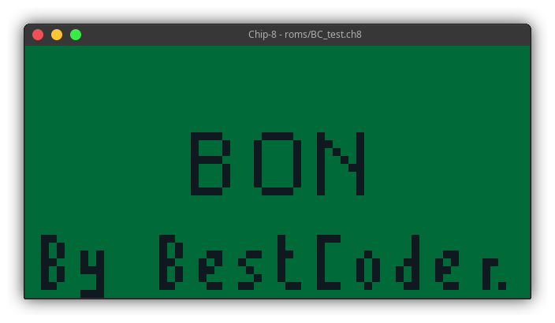

# pizza8

Simple C++ Chip-8 interpreter implemented in SDL2 

This has been done in a very small amount of time ~~across 2 days~~ (actually took more time to fix stuff), ~~could be called a "speedrun" if you want~~ 

## Future plans

Support for SuperChip/CHIP-48, hopefully
