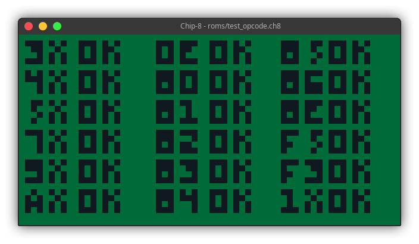

# pizza8

Fast C++ Chip-8 interpreter implemented in SDL2</br>

This has been done in a very small amount of time ~~across 2 days~~ (actually took more time to fix stuff), ~~could be called a "speedrun" if you want~~</br>

## Installation and usage

Have CMake, Make and SDL2 installed. Run `cmake -B build/` in the root directory and then `make -j$(nproc --all) -C build/`</br>

To launch a rom, run `./chip-8 <roms folder>/<the rom> [options]`</br>

Options (just two for now :P):

```
--delay/-d:
    -Specify the delay (in milliseconds, default: 16 [1]) between each frame

--scale/-s:
    -Specify a window scale (default: 10, so the window will be 640x320)
```

**Do note this has been tested only on Linux**
**[1] DON'T USE "-d 0"**




## Future plans

Support for SuperChip/CHIP-48, hopefully
